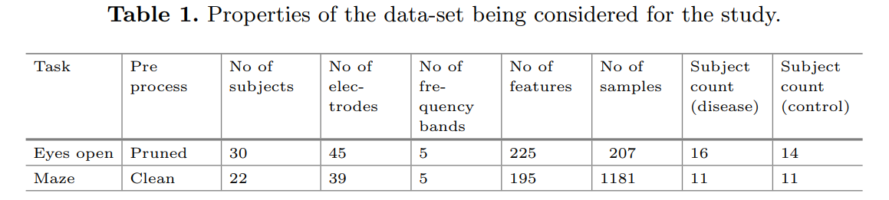
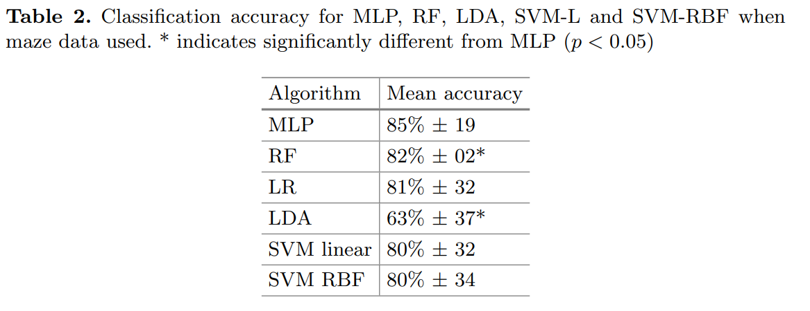
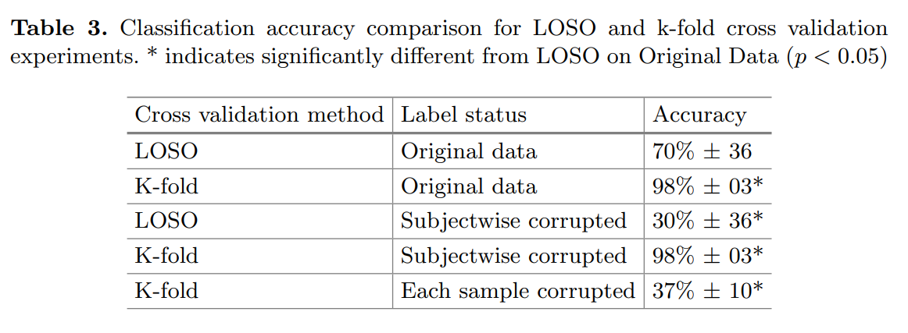

In this study, we use a multilayer perceptron (MLP) to show importance
of Leave-One-Subject-Out (LOSO) cross validation machine learning and how MLP is effective in making use of clean EEG data in mining out the features important for disease classification.

## DATA EEG ACQUISITION ANS PREPROCESSING:
### DATA ACQUISITION:
The study used a 128-channel EEG system (Compumedics, Neuroscan Quick cap or Falk Minnow Easy-cap) to record EEG data from participants at a 2000 Hz sampling rate with a 500 Hz low-pass filter. Data from both caps were aligned using the 10–20 electrode positioning system, and a linked-ear reference was used. Recordings were conducted in a Faraday cage to minimize electromagnetic noise, with visual and auditory instructions provided via Presentation software. Manual responses were recorded using a custom-built response panel. Two mental tasks were included: a resting eyes-open task, where participants fixated on a white cross for 40 seconds, and a maze task, where participants navigated a hidden pathway on a screen, with the task ending after correct completion twice or after six minutes.
### ARTEFACT REMOVAL
-  data was resampled 2000 Hz - 1000 Hz.
-   recorded EEG was also detrended using the SIFT toolbox
-   EEG was then re-referenced using the common average reference.
-   Faulty channels were determined using three different methods: **probabilistic** (threshold = 5), **kurtosis** (threshold = 5), and **spectra** (threshold = 2, 20 75 Hz)

### DATASET FOR CURRENT STUDY:

In eyes open task, there were 30 subjects. Each subject had 5 to 8 non-overlapping, 5 s epochs making the total data points 207. Data from 45 electrodes in 5 bands (delta: 1–4 Hz, theta: 4–8 Hz, alpha: 8–13 Hz, beta: 13–25 Hz and gamma: 25 Hz) was used and this results in 225 (45 × 5) features.

## METHOD:
### MULTI- LAYER PERCEPTRON:
A Multi-Layer Perceptron (MLP) is a basic deep learning architecture. It
uses a supervised learning process called back propagation to train the model. Nodes of each hidden layer of an MLP are connected to every node in the previous and following through weights. The non-linearity of the node output is given by activation functions. The Loss function used was the binary-cross entropy and Adam as the optimizer.

### MACHINE LEARNING METHOD
- The study has two parts: the first part was testing the effectiveness of MLP and the second part evaluating the necessity of LOSO cross validation.
- The study used Random Forest (RF), Logical Regression (LR), Linear discriminant analysis (LDA), Support vector machine (SVM) with linear and RBF kernel to confirm the study findings.
- The cleaned and epoched EEG was standardised
- Best performance was found with: 2 hidden and output layers with, respectively, 12, 8 and 1 units, Adam optimizer, ReLU and sigmoid as activation functions for hidden layers and outputlayer, respectively, 150 epochs and a batch size of 10
- For leave one subject out (LOSO) cross validation experiment, all data from all subjects was used for training except one, which was used for testing purpose.
- For K-fold cross validation data samples were separated in 9:1 ratio where 90% samples (approx. 185) were used for training and 10% (approx. 20) were used for testing in each fold

## RESULTS:

### LOSO VERSUS K-FOLD CROSS-VALIDATION:
This part of the study was also performed using “clean” data from the eyes open task. Only the MLP algorithm was used for all classification. Five classification experiments were done to show the need for of LOSO when evaluating disease classification algorithms. Corrupted labels were used for both k-fold and LOSO evaluation.

## DISCUSSION:
The study evaluated the effectiveness of a 4-layer MLP in distinguishing schizophrenia subjects from control groups using clean maze EEG data. Results showed the MLP classifier significantly outperformed RF and LDA and was comparable to LR, SVM-L, and SVM-RBF, even with a small dataset (20 subjects, 195 features, 1181 samples). The necessity of LOSO evaluation was also tested. While k-fold cross-validation yielded a high accuracy (98%), indicating the model learned subject-specific rather than disease-specific features, LOSO validation resulted in a lower accuracy (70%), highlighting the need for LOSO in realistic scenarios. Further experiments with corrupted labels confirmed that k-fold evaluation is misleading for disease diagnosis, as it learns subject-specific features instead of disease-related ones. Therefore, LOSO cross-validation is essential for accurate disease classification using scalp-recorded EEG data.

