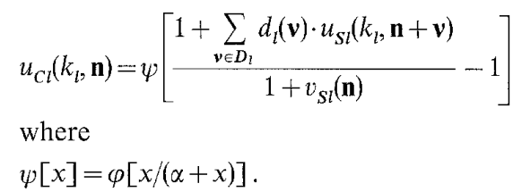
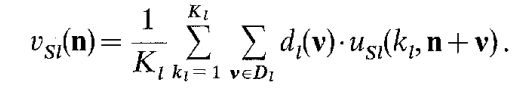
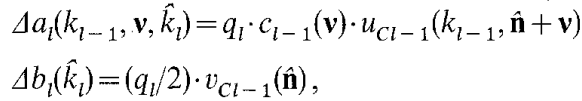
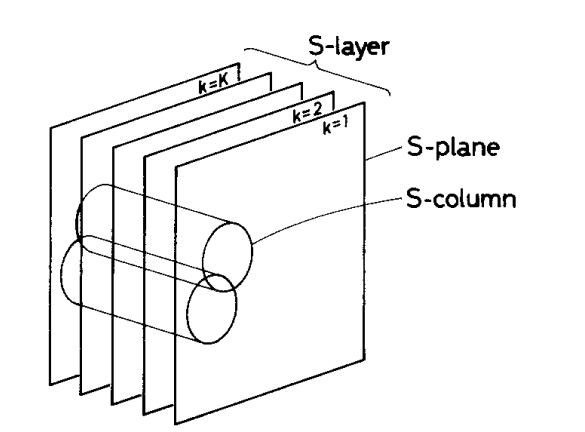

# NEOCOGNITRON
## Introduction:
The models that explained the working of the brain towards recognition of image patterns failed with distortion in the image. The neocognitron tried to solve this problem using a concept of unsupervised learning.According to the hierarchy model by Hubel and Wiesel, the neural network in the visual cortex has a hierarchy structure :***LGB*** **(lateral geniculate body)**-->***simple cells***-->***complex cells***-->***lower order hypercomplex cells***-->***higher order hypercomplex cell***.s. In this hierarchy, a cell in a higher stage generally has a tendency to respond selectively to a more complicated feature of the stimulus pattern, and, at the same time, has a larger receptive field, and is more insensitive to the shift in position of the stimulus pattern. The cells in the highest 
stage are supposed to respond only to specific stimulus patterns without affected by the position or the size of the stimuli. For  this we need to normalize the position of the input pattern beforehand.

# Structure of the network:

The following image demonstrates the cascade structure of the network.

In the neocognitron, only the input synapses to S-cells are supposed to have plasticity and to be modifiable. We will use notations ***Usl ( kl ,n )*** to represent the output of an S-cell in the ***kl*** th S-plane in the ***l***-th module, and ***Ucl ( kl , n )*** to represent the output of a C-cell in the ***kl*** th C-plane in that module, where ***n*** is the two-dimensional co-ordinates representing the position of these cell's receptive fields in the input layer. 
The folloeing figure demostrates the interconnections among various layers:

The deeper the layer is, the larger becomes the receptive field of each cell of that layer. The density of the cells in each cell-plane is so determined as to decrease in accordance with the 
increase of the size of the receptive fields. Hence, the total number of the cells in each cell-plane decreases with the depth of the cell-plane in the network.
Apart from excitatory cells we also have inhibitory cells ***Vsl ( n )*** and ***Vcl ( n )*** in S-layers and C-layers. 
### Outputs:
The output of an S-cell in the ***kl*** -th S-plane in the ***l***-th module is described below. 

Here, ***al( kl- 1, v, kl )*** and ***bl ( k l )*** represent the efficiencies of the excitatory and inhibitory synapses, respectively. Parameter ***rl*** in prescribes the efficacy of the inhibitory input. The larger the value of ***rl*** is, more 
selective becomes cell's response to its specific feature. Therefore, the value of ***rl*** should be determined with a compromise between the ability to differentiate similar patterns and the ability to tolerate the distortion of the pattern's shape. 
The inhibitory cell ***vC/-l(n)***, which have inhibitory synaptic connections to this S-cell, has an r.m.s.-type (root-mean-square type) input-to-output characteristic:

where ***cl (v)*** represents the efficiency of the unmodifiable excitatory synapses, and is set to be a monotonically decreasing function of ***|v|***. If a stimulus pattern which elicits a response from an S-cell is shifted in parallel in its position on the input layer, another S-cell in the same S-plane will respond instead of the first cell. The synaptic connections from S-layers to C-layers are fixed and unmodifiable.
The output of a C-cell 
in the ***kl*** -th C-plane in the ***l-*** th module is given by

The inhibitory cell ***Vsl( n )***, which sends inhibitory signals to this C-cell and makes up the system of lateral inhibition, yields an output proportional to the (weighted) arithmetic mean of its inputs : 

the efficiency of the unmodifiable excitatory synapse ***dl( v )*** is set to be a monotonically decreasing function of ***|v|***

## Self organization of the network
At first, several "representative" S-cells are selected from each S-layer every time when a stimulus pattern is presented. The representative is selected among the S-cells which have yielded large outputs, but the number of the representatives is so restricted that more than one representative are not selected from any single S-plane. Let cell ***Usl(kl', n' )*** be selected as a representative. The modifiable synapses which are afferent to the S-cells of the ***kl*** th S-plane, are reinforced by the amount shown below:

The cells in the S-plane from which no representative is selected, however, do not have their input synapses reinforced at all. In the initial state, the modifiable excitatory synapses are set to have small positive values. The initial values of 
modifiable inhibitory synapses b~(kt) are set to be zero. 
### S-coloumn:
An S-column contains S-cells from all the S-planes. That is, an S-column contains various kinds of feature extracting cells in it, but the receptive fields of these cells are situated almost at the same position. There are a lot of such S-columns in a single S-layer. Since S-columns have overlapping with one another, there is a possibility that a single S-cell is contained in two or more S-columns.
From each S-column, every time when a stimulus 
pattern is presented, the S-cell which is yielding the largest output is chosen as a candidate for the representatives. Hence, there is a possibility that a number of candidates appear in a single S-plane. If two or more candidates appear in a single S-plane, only the one which is yielding the largest output among them is selected as the representative from that S-plane. In case only one candidate appears in an S-plane, the candidate is unconditionally determined as the representative from that S-plane. If no candidate appears in an S-plane, no representative is selected from that S-plane. There is not a possibility of formation of redundant connections such that two or more S-planes are used for detection of one and the same feature.

## Important Inferences:
- The C-cell responds to a feature situated in a certain area in the input layer, and its response is less affected by the shift in position of the stimulus pattern than that of presynaptic S-cells. 
- Since operations of this kind are repeatedly applied through a cascade connection of modular structures of S- and C-layers, each individual cell in the network becomes to have wider receptive field in accordance with the increased number of modules before it, and, at the same time, becomes more tolerant of shift in position of the input pattern.
- the neocognitron is able to make a correct pattern recognition even if input patterns have some distortion in shape. 

## Computer Simulation:
In the computer simulation, we consider a seven layered network: Uo--> Us1 --> Uc1 --> Us2 --> Uc2 --> Us3 --> Uc3. The numbers of excitatory cells in these seven layers are: 16 x 16 in Uo, 16 x16 x 24 in Us1, 10 x 10 x 24 in Uc1, 8 x 8 x 24 in Us2, 6x 6 x 24inUc2, 2 x 2 x 24 in Us3, and 24 in Uc3. In the last layer Uc3, each of the 24 cell-planes contains only one excitatory cell.

The number of cells contained in the connectable 
area Sl is always 5 x 5 for every S-layer. Hence, the number of input synapses 3 to each S-cell is 5 x 5 in layer Us1 and 5 x 5 x 24 in layers Us2 and Us3.

The number of excitatory input synapses to each 
C-cell is 5 x 5 in layers Ucl and Uc2, and is 2 x 2 in layer Uc3. Every S-column has a size such that it contains 5 x 5 x 24 cells for layers Us1 and Us2, and 2 x 2 x 24 cells for layer Us3.
 ***r1 =4.0 and r2 = r3 = 1.5***
***c l (v)*** is determined so as to satisfy the equation.

q1 = l.0 and q2 = q3 = 16.0.

Each of the five stimulus patterns has been presented 20 times to the network.

In one experiment, the ueocognitron has been self-organized using four stimulus patterns "X", "Y", "T", and "Z". These four patterns resemble each other in shape: For instance, the upper parts of "X" and "Y" have an identical shape, and the diagonal lines in "Z" and "X" have an identical inclination, and so on. After repetitive presentation of these resembling patterns, the neocognitron has also acquired the ability to discriminate them correctly. 

